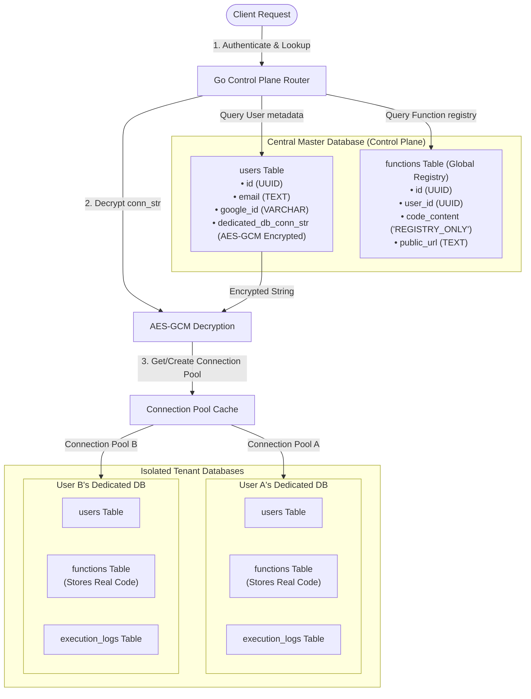

# Database Architecture & Schema Design

This document details the multi-tenant database design, table schemas, connection pooling mechanisms, and isolation strategies used in the Mini-Lambda Serverless Platform.

---

## 🏗️ Multi-Tenant Database Architecture

The platform uses a **hybrid multi-tenant database-per-user (isolated database)** design to guarantee high data security and isolation for serverless functions and logs.

### Database Relationship Diagram

The following diagram illustrates how the Central Master DB routes requests and establishes connection pools to each tenant's isolated database.



---

## 🔑 The Master Database
The **Master Database** (connected via the `NEON_DB_URL` environment variable) serves as the **Control Plane Registry**. Its primary responsibilities are:
1. **User Identity Resolution**: Mapping Google OAuth identities (`google_id` and `email`) to internal user UUIDs.
2. **Metadata Registry**: Storing the global directory of functions and their public endpoints (`public_url`), allowing the ingress router to instantly identify which user owns an incoming trigger request.
3. **Database Directory**: Storing the connection strings for all provisioned user databases.

> [!IMPORTANT]
> The `dedicated_db_conn_str` column in the Master Database is **never stored as plain text**. It is encrypted using AES-GCM 256-bit encryption with a key specified in `DB_ENCRYPTION_KEY` to prevent credential leakage.

---

## 📂 Detailed Database Schema

The following tables are created globally in the Master DB. Additionally, when a user's isolated database is provisioned, a local copy of this schema is bootstrapped inside their database to structure their private functions and execution logs.

### 1. `users` Table
Stores registered platform operators and end-users.

| Column | Type | Constraints | Description |
| :--- | :--- | :--- | :--- |
| `id` | `UUID` | `PRIMARY KEY` | Unique identifier generated for the user. |
| `email` | `TEXT` | `UNIQUE`, `NOT NULL` | The user's authenticated email address. |
| `google_id` | `VARCHAR(255)` | `UNIQUE` | Unique identifier returned by Google OAuth. |
| `dedicated_db_conn_str` | `TEXT` | - | AES-GCM encrypted connection string of the user's isolated database. (Master DB only) |

### 2. `functions` Table
Stores deployed code snippets and runtime parameters.

| Column | Type | Constraints | Description |
| :--- | :--- | :--- | :--- |
| `id` | `UUID` | `PRIMARY KEY` | Unique identifier generated for the function. |
| `user_id` | `UUID` | `REFERENCES users(id) ON DELETE CASCADE` | The creator/owner of the function. |
| `code_content` | `TEXT` | `NOT NULL` | The function source code. (Replaced with `"REGISTRY_ONLY"` on the Master DB). |
| `language` | `TEXT` | `DEFAULT 'javascript'` | Runtime engine for executing the code (`javascript` or `python`). |
| `public_url` | `TEXT` | `UNIQUE`, `NOT NULL` | The unique public HTTP path to invoke the function. |
| `created_at` | `TIMESTAMPTZ`| `DEFAULT CURRENT_TIMESTAMP` | The timestamp when the function was deployed. |

* **Index**: `idx_functions_user_id` is applied on `user_id` to speed up function listings and deployments.

### 3. `execution_logs` Table
Stores output logs and execution metrics.

| Column | Type | Constraints | Description |
| :--- | :--- | :--- | :--- |
| `id` | `UUID` | `PRIMARY KEY` | Unique identifier generated for the log record. |
| `function_id` | `UUID` | `REFERENCES functions(id) ON DELETE CASCADE` | The function associated with this execution. |
| `log_output` | `TEXT` | `NOT NULL` | Captured console outputs (`stdout` & `stderr`). |
| `duration_ms` | `INT` | - | Execution duration in milliseconds. |
| `status_code` | `INT` | - | The HTTP response status code of the function execution. |
| `error_message` | `TEXT` | - | Stack traces or timeout errors if execution failed. |
| `timestamp` | `TIMESTAMPTZ`| `DEFAULT CURRENT_TIMESTAMP` | The execution timestamp. |

* **Index**: `idx_execution_logs_function_id` is applied on `function_id` to quickly fetch log historical data.

---

## 🔄 How the Master DB Connects to User Databases

When a request arrives to execute or deploy a function, the Control Plane performs a dynamic routing dance:

```
[Incoming Request]
       │
       ▼
1. Fetch `dedicated_db_conn_str` for the User from the Master DB.
       │
       ▼
2. Decrypt the connection string using AES-GCM.
       │
       ▼
3. Check the Connection Cache (go map `UserDBPools`) using Double-Checked Locking.
       │
       ├─► [Cache Hit]  Retrieve the existing pool `*sql.DB`.
       │
       └─► [Cache Miss] Initialize a new `sql.DB` connection pool, set limits:
                        - Max Open Connections: 10
                        - Max Idle Connections: 2
                        - Max Lifetime: 5 Minutes
                        Then store it in the cache map.
       │
       ▼
4. Execute query/insertion directly on the User's isolated database.
```

---

## ⚡ Auto-Provisioning Lifecycle

1. **API Trigger**: The frontend triggers a `POST` to `/api/settings/db/provision`.
2. **Neon API Request**: The backend invokes the Neon Project API `POST /projects/{id}/databases` to create a database instance dynamically named `db_user_<uuid_without_hyphens>`.
3. **Database Migration**: The backend connects to the database via its new connection string and executes the schema DDL statements in `schema.sql` to initialize local tables.
4. **User Sync**: To prevent foreign key failures, the backend replicates the user's `id` and `email` into the isolated database's `users` table.
5. **Credential Encryption**: The backend encrypts the new connection string and updates the user's `dedicated_db_conn_str` in the Master DB.

---

## 🛠️ Offline Mock Mode Fallback
If the master database connection (`NEON_DB_URL`) fails to initialize during server startup, the server automatically enables **Mock Mode**.
* Instead of interacting with Neon Postgres, it falls back to **in-memory thread-safe maps** (`MockUsers`, `MockFunctions`, and `MockLogs`) protected by a read-write mutex.
* **Note**: In Mock Mode, database data is ephemeral and will be wiped if the Go server is restarted.
