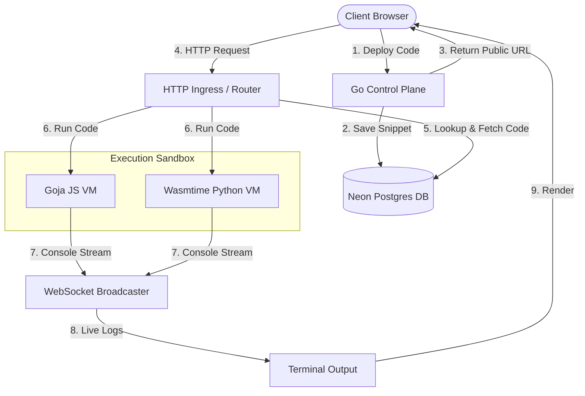

# ⚡ Mini AWS Lambda (Multi-Tenant Serverless Platform)

A lightweight, high-performance, multi-tenant serverless platform designed to eliminate traditional cloud infrastructure complexity. It provides a frictionless **"Code-to-URL"** deployment and execution workflow using isolated sandboxes (Goja and Wasmtime) and real-time execution log streaming.

---

## 🏗️ System Architecture

The control plane is written in Go, acting as both a deployment manager and execution router.



For a comprehensive breakdown of the components, request workflows, and database entity relationship models, refer to [systemdesign.md](./systemdesign.md).

---

## 🚀 Key Features

* **Sub-millisecond Cold Starts**: Uses native Goja (ECMAScript 5.1 engine) to execute JavaScript code in memory without process fork overhead.
* **Wasm & Python Sandboxing**: Integrates the Wasmtime JIT compiler to run Python code via `python-3.11.wasm`. Falls back gracefully to local python3 execution wrapped in timeouts and ulimit caps.
* **Real-time Live Streaming**: Captures console output and broadcasts it to connected client terminals via WebSockets instantly.
* **Auto DB-Backed Log Tracking**: Logs run metadata (durations, exit status, errors) to Neon Postgres for analytics.
* **Secure Sandbox Guardrails**:
  * Goja: Constrained stack depth (max 250 frames) to block recursion-based OOM.
  * Python Fallback: Isolated process groups and restricted virtual memory (128MB), output file sizes (512KB), and process limits (15) via `ulimit`.

---

## 🛠️ Getting Started & Setup

### Prerequisites
* **Go**: `v1.25` or higher.
* **Python**: `v3.x` (required if running Python functions without WASM binaries).
* **Database**: A PostgreSQL instance (e.g., [Neon Postgres](https://neon.tech/)).

### 1. Configuration
Create a `.env` file in the root of your project directory and add your Neon connection string:
```env
NEON_DB_URL="postgresql://<user>:<password>@<host>/<database>?sslmode=require"
```

### 2. Database Schema Initialization (Optional)
If you have already executed the SQL schema script directly inside the Neon SQL Editor, you can skip this step. Otherwise, you can run the root database migrator tool to apply all schema definitions, indices, and the dummy test user to your database:
```bash
go run main.go
```

---

## 📡 Running the Platform

### 1. Start the Backend Control Plane
Run the Go API server on port `:8080`:
```bash
go run control-plane/cmd/server/main.go
```

### 2. Launch the Developer Frontend
Open the client interface directly in your browser:
```bash
# On Linux / macOS
open frontend/src/index.html

# Or simply open the file path inside your web browser.
```

---

## 📖 API Documentation

### 1. `POST /api/deploy`
Deploys a serverless function snippet.
* **Headers**: `Content-Type: application/json`
* **Request Body**:
  ```json
  {
    "user_id": "<authenticated_user_uuid>",
    "code_content": "print('Hello World!')",
    "language": "python"
  }
  ```
* **Response (201 Created)**:
  ```json
  {
    "function_id": "9b1deb4d-3b7d-4bad-9bdd-2b0d7b3dcb6d",
    "public_url": "/user/code/9b1deb4d-3b7d-4bad-9bdd-2b0d7b3dcb6d",
    "message": "Deployment successful!"
  }
  ```

### 2. `GET /user/code/{function_id}`
Triggers execution of the deployed function in the isolated sandbox.
* **Response (200 OK)**: Plaintext console output or VM execution result.

### 3. `GET /api/ws`
Establishes WebSocket connections to broadcast live console logs during execution.

For static typed language the env is yet to be done

