# Implementation Plan - Google OAuth & Dynamic Neon Database Provisioning

This plan outlines the feasibility and architectural steps to integrate Google OAuth 2.0 and dynamically provision isolated databases/schemas for each user on Neon Cloud using the Neon API.

---

## 🏛️ Architectural Overview

Yes, this architecture is **fully possible** and commonly implemented in modern database-as-a-service (DBaaS) integrations. We use a hybrid multi-tenant approach:
1. **Master Control Database**: A central database to store user accounts, Google OAuth profiles, and metadata (like their dedicated database names and connection details).
2. **Neon API Integration**: Using Neon's REST API to programmatically spin up new databases or branches for users when they register.
3. **Dynamic Routing**: The Go backend retrieves the user's dedicated connection string on-demand to read/write code and logs to their private database.

```mermaid
sequenceDiagram
    participant User as Client Browser
    participant Go as Go Backend
    participant Google as Google OAuth 2.0
    participant Neon as Neon REST API
    participant MasterDB as Master Control DB
    participant UserDB as User's Isolated DB

    User->>Go: 1. Click Login with Google
    Go->>User: Redirects to Google Consent Page
    User->>Google: Authenticates
    Google->>User: Redirects to Go Callback with Code
    User->>Go: 2. Send Authorization Code
    Go->>Google: Exchange Code for Access Token & Profile
    Google->>Go: Return User Profile (Email, ID)
    
    rect rgb(20, 20, 30)
        Note over Go, Neon: Onboarding Flow for New Users
        Go->>MasterDB: Check if user exists (new user?)
        Go->>Neon: 3. POST /api/v2/projects/{id}/databases (Create DB for User)
        Neon->>Go: Return DB Name & Connection Details
        Go->>MasterDB: 4. Save User profile & Dedicated Connection String
    end

    User->>Go: 5. Deploy Code (with Session Cookie/JWT)
    Go->>MasterDB: Fetch User's Connection String
    Go->>UserDB: 6. Save Function code to User's Dedicated DB
    Go-->>User: Deployment Success
```



---

## 🛠️ Proposed Implementation Steps

### Phase 1: Google OAuth Authentication
1. **Google Console Setup**: 
   * Create a project in the Google Cloud Console.
   * Enable the OAuth 2.0 API.
   * Add authorized redirect URIs (e.g., `http://localhost:8080/api/auth/callback/google`).
2. **Backend Authentication Handlers**:
   * Add `/api/auth/login` to redirect users to Google.
   * Add `/api/auth/callback` to verify the code and sign a JSON Web Token (JWT) or session cookie for the client.
3. **Database Schema Update**:
   * Modify the master `users` table to support OAuth fields:
     ```sql
     ALTER TABLE users ADD COLUMN google_id VARCHAR(255) UNIQUE;
     ALTER TABLE users ADD COLUMN dedicated_db_conn_str TEXT;
     ```

### Phase 2: Neon API Database Provisioning
1. **Neon API Token**:
   * Create an API Key in the Neon Console.
   * Store it as `NEON_API_KEY` in the Go backend environment variables.
2. **Programmatic DB Creation in Go**:
   * When a new user logs in, the backend sends a REST request to Neon to create a dedicated database:
     * **Endpoint**: `POST https://api.neon.tech/api/v2/projects/{project_id}/databases`
     * **Headers**: `Authorization: Bearer <NEON_API_KEY>`
     * **Body**:
       ```json
       {
         "database": {
           "name": "db_user_<uuid_sanitized>"
         }
       }
       ```
3. **Generate Dedicated Connection String**:
   * Construct the connection string dynamically for the new database:
     `postgres://<user>:<password>@<host>/db_user_<uuid_sanitized>?sslmode=require`
   * Run the schema migrator against this newly created database instance to prepare the tables (`functions`, `execution_logs`) on behalf of the user.

### Phase 3: Dynamic Connection Pooling & Routing
1. **Backend Database Manager**:
   * Implement a database connection registry in the backend. Instead of using a single global `db.DB` instance, maintain a map of active database pools key-indexed by `User ID`.
2. **Request Routing**:
   * For `/api/deploy` and execution trigger endpoints, authenticate the user session.
   * Retrieve their dedicated database connection pool and execute queries against it.

---

## 🔒 Security & Scaling Considerations
* **DB Limits**: Neon's Free tier limits the number of databases or projects you can create. For production scaling, you would migrate to a Neon paid tier or use **PostgreSQL Schemas** (namespaces within the same database) instead of completely separate database instances.
* **Encryption**: Dedicated connection strings stored in the Master DB should be encrypted at rest.
