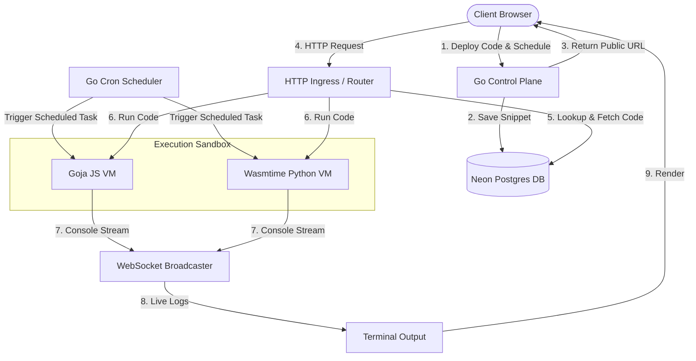

# System Design: Mini AWS Lambda (Multi-Tenant Serverless Platform)

This document provides a detailed overview of the system architecture, component breakdown, database schema, and request lifecycle workflows for the Mini AWS Lambda platform.

---

## 🏗️ Architecture Overview

The system is designed to provide a sub-millisecond **"Code-to-URL"** deployment and execution lifecycle. The core backend is written in Go, utilizing a PostgreSQL database (Neon) for state storage, Goja (JS VM) and Wasmtime (WebAssembly-based Python VM) for isolated sandboxed execution, and WebSockets for real-time log streaming.

Functions can be triggered either reactively via incoming HTTP request URL endpoints, or proactively using the background **Cron Scheduler** that executes tasks at defined intervals.

### System Diagram



---

## 🧩 Component Breakdown

### 1. Frontend Dashboard (Client Interface)
* **Code Editor**: Provides a UI for writing function code (JavaScript / Python). 
* **Quick-start Templates**: An editor header custom-styled dropdown menu offering templates for Basic Handlers, lightweight REST APIs, and full interactive Static HTML Sites.
* **Standalone Developer Documentation Page**: A dedicated standalone documentation page (`docs.html`) outlining platform concepts, ingress/egress APIs, and code specifications, designed for both technical and non-technical stakeholders.
* **Deployment Trigger**: Posts code payload and optional schedule to the control plane deployment endpoint.
* **Cron Toggle & Configuration**: Allows developers to easily toggle scheduled execution, choose frequency presets, or type standard 5-field cron strings.
* **WebSocket Console**: Establishes a persistent connection to the log streaming service, updating a simulated terminal with live execution logs (`stdout`/`stderr`).

### 2. Go Control Plane (HTTP API Server)
* **Deployment Handler (`/api/deploy`)**:
  * Authenticates and authorizes the request (maps to a `user_id`).
  * Generates a UUID for the function.
  * Persists the function source code and cron schedule string to the Neon Postgres tables.
  * Formulates and returns the public trigger URL: `/user/code/{uuid}`.
* **Execution Router (`/user/code/{uuid}`)**:
  * Extracts the function UUID from incoming requests.
  * Fetches the code content from Postgres.
  * Initializes the requested execution sandbox runtime context (Goja or Wasmtime).
  * Runs the function and returns the HTTP response.
* **WebSocket Log Service (`/api/ws`)**:
  * Upgrades incoming client requests to WebSocket connections.
  * Tracks active dashboard client connections.
  * Receives logs from the sandboxes via a callback method and broadcasts them instantly to all connected consoles.

### 3. Go Background Cron Scheduler
* On server boot, queries all functions with active `cron_expression` configurations.
* Uses the `github.com/robfig/cron/v3` scheduler thread to track cron intervals.
* Dynamically registers newly deployed cron jobs when users complete deployment configurations.
* Fires triggers to run functions in sandboxes in background threads and streams outputs back to DBs and consoles.

### 4. Execution Sandbox Runtimes
* **JavaScript VM (Goja)**:
  * Uses the native Goja engine for execution (eliminating Node.js process fork overhead).
  * Exposes a sandboxed global `fetch` function for outbound network integrations (timeout restricted).
  * Overrides the default JS `console.log` global object to redirect output to the real-time logger callback while collecting it for the final HTTP response.
  * Implements execution timeouts via a background thread to interrupt infinite loops.
* **Python/Wasm VM (Wasmtime)**:
  * Uses WebAssembly to isolate execution.
  * Configures a virtual WASI environment with standard out and standard error redirected to secure temporary files.
  * Runs the user script by invoking a sandboxed Python WASM interpreter (`python-3.11.wasm`).

### 5. Neon Postgres State Management
* Stores application states securely with relational integrity:
  * **`users` Table**: Tracks developers allowed to deploy and run code.
  * **`functions` Table**: Stores deployed functions, including code contents, cron expressions, creator details, and trigger paths.
  * **`execution_logs` Table**: Records execution metadata, log outputs, durations, and error reports.

---

## 🔄 Core Workflows

### A. Code-to-URL Deployment Flow
1. Developer clicks **Deploy** in the frontend editor.
2. The browser sends a `POST` request containing the user's ID, code content, language, and optional `cron_expression` to `/api/deploy`.
3. The control plane generates a unique function ID (UUID).
4. The control plane saves the function record into the Neon Postgres master database and isolated user database.
5. The control plane registers/updates the background schedule trigger in the active Cron engine.
6. The control plane returns a JSON payload containing the function ID and public endpoint URL back to the developer's dashboard.

### B. HTTP Trigger Execution Flow
1. An external client or browser hits the public trigger URL: `http://localhost:8080/user/code/{uuid}`.
2. The router extracts the UUID and queries the Neon Postgres database to retrieve the function's code content.
3. The control plane spins up a lightweight VM context corresponding to the language:
   * **JS**: Initializes a Goja VM, overrides `console` logging, executes the function code, and enforces a 2-second timeout.
   * **Python**: Loads the Wasmtime engine, reads `python-3.11.wasm`, passes the script arguments, and reads output files.
4. If the execution encounters an error or timeout, a `500 Internal Server Error` or custom error code is returned. Otherwise, the sandbox output is sent back as a `200 OK` plaintext response.

### C. Scheduled Background Executions Flow
1. The background Cron engine matching thread fires at a scheduled interval.
2. It resolves the target user's isolated database connection, reads function code, and invokes it in the appropriate sandbox runtime.
3. Emits `[Cron Run]` prefix headers and live execution logs to the database tables and streams them to the user's active WebSocket console.

### D. Real-Time Log Streaming Flow
1. While code is executing inside a sandbox (e.g. Goja VM), any call to `console.log` invokes a callback function registered with the engine.
2. The callback calls `BroadcastLog` inside the WebSocket package.
3. The WebSocket server iterates over all active dashboard connections and transmits the log message.
4. The frontend appends the message to the logs terminal instantly.

---

## 📡 API Endpoints

### 1. Deploy Function
* **Endpoint**: `/api/deploy`
* **Method**: `POST`
* **Content-Type**: `application/json`
* **Request Payload**:
  ```json
  {
    "user_id": "<authenticated_user_uuid>",
    "code_content": "function handler(event) {\n    console.log(\"Hello from Mini-Lambda!\");\n    return { status: 200, message: \"Success\" };\n}",
    "language": "javascript",
    "cron_expression": "*/5 * * * *"
  }
  ```
* **Response Payload (Status `201 Created`)**:
  ```json
  {
    "function_id": "550e8400-e29b-41d4-a716-446655440000",
    "public_url": "/user/code/550e8400-e29b-41d4-a716-446655440000",
    "message": "Deployment successful!"
  }
  ```

---

## 🗄️ Database Schema Design

```sql
-- Enable pgcrypto extension for older PostgreSQL compatibility
CREATE EXTENSION IF NOT EXISTS "pgcrypto";

-- Create the users table
CREATE TABLE IF NOT EXISTS users (
    id UUID PRIMARY KEY DEFAULT gen_random_uuid(),
    email TEXT UNIQUE NOT NULL,
    google_id VARCHAR(255) UNIQUE,
    dedicated_db_conn_str TEXT
);

-- Create the functions table
CREATE TABLE IF NOT EXISTS functions (
    id UUID PRIMARY KEY DEFAULT gen_random_uuid(),
    user_id UUID REFERENCES users(id) ON DELETE CASCADE,
    code_content TEXT NOT NULL,
    language TEXT NOT NULL DEFAULT 'javascript',
    public_url TEXT UNIQUE NOT NULL,
    cron_expression VARCHAR(255) DEFAULT NULL,
    created_at TIMESTAMP WITH TIME ZONE DEFAULT CURRENT_TIMESTAMP
);

-- Index foreign keys for faster queries
CREATE INDEX IF NOT EXISTS idx_functions_user_id ON functions(user_id);

-- Create the execution logs table
CREATE TABLE IF NOT EXISTS execution_logs (
    id UUID PRIMARY KEY DEFAULT gen_random_uuid(),
    function_id UUID REFERENCES functions(id) ON DELETE CASCADE,
    log_output TEXT NOT NULL,
    duration_ms INT,
    status_code INT,
    error_message TEXT,
    timestamp TIMESTAMP WITH TIME ZONE DEFAULT CURRENT_TIMESTAMP
);

-- Index foreign keys for faster queries
CREATE INDEX IF NOT EXISTS idx_execution_logs_function_id ON execution_logs(function_id);
```

---

## 🔒 Security, Authentication & Sandboxing Principles

1. **Authentication Flow**: Authentication is handled via Google OAuth 2.0. Successful authentication stores a secure JWT `session_token` cookie. The backend enforces active session checks on all deployment and logging API routes.
2. **Memory Isolation**: Goja runs scripts natively inside the Go process's memory space, meaning scripts cannot interact with host process memory directly unless exposed through runtime bindings. Wasmtime runs compiled binaries inside isolated memory stacks.
3. **Outbound Request Constraints (`fetch` API)**: To allow network requests securely, the sandbox injects a wrapper-bound `fetch` function that enforces a strict **5-second timeout** and caps response bodies to **512KB** to prevent resource exhaustion attacks.
4. **Access Control**: Neither sandbox allows system-level imports by default (e.g., Goja does not support standard Node.js libraries like `fs`, `net`, or `child_process`). 
5. **Execution Guardrails**: 
   * Execution time is restricted by an interrupt timer (currently set to 2 seconds).
   * Local Python executions are constrained using process groups and restricted virtual memory (128MB), output file sizes (512KB), and process limits (15) via `ulimit`.
