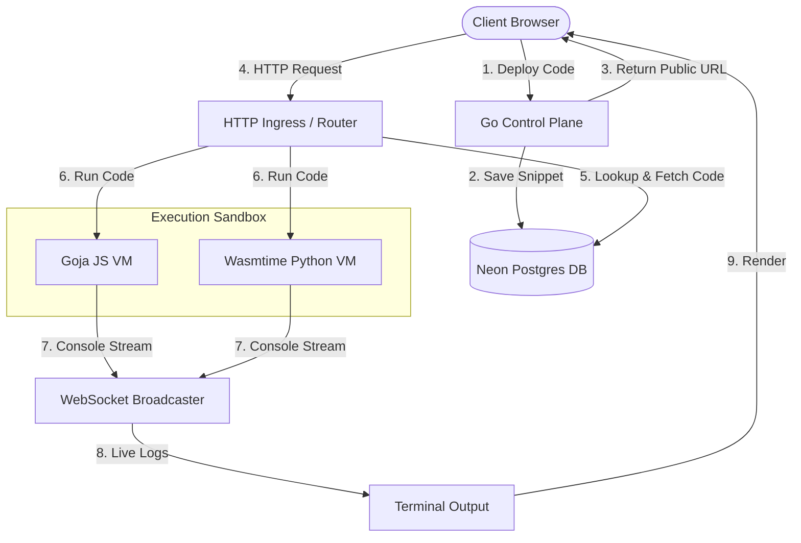

# System Design: Mini AWS Lambda (Multi-Tenant Serverless Platform)

This document provides a detailed overview of the system architecture, component breakdown, database schema, and request lifecycle workflows for the Mini AWS Lambda platform.

---

## 🏗️ Architecture Overview

The system is designed to provide a sub-millisecond **"Code-to-URL"** deployment and execution lifecycle. The core backend is written in Go, utilizing a PostgreSQL database (Neon) for state storage, Goja (JS VM) and Wasmtime (WebAssembly-based Python VM) for isolated sandboxed execution, and WebSockets for real-time log streaming.

### System Diagram



---

## 🧩 Component Breakdown

### 1. Frontend Dashboard (Client Interface)
* **Code Editor**: Provides a UI for writing function code (JavaScript / Python). 
* **Deployment Trigger**: Posts code payload to the control plane deployment endpoint.
* **WebSocket Console**: Establishes a persistent connection to the log streaming service, updating a simulated terminal with live execution logs (`stdout`/`stderr`).

### 2. Go Control Plane (HTTP API Server)
* **Deployment Handler (`/api/deploy`)**:
  * Authenticates and authorizes the request (maps to a `user_id`).
  * Generates a UUID for the function.
  * Persists the function source code to Neon Postgres.
  * Formulates and returns the public trigger URL: `/user/code/{uuid}`.
* **Execution Router (`/user/code/{uuid}`)**:
  * Extracts the function UUID from incoming requests.
  * Fetches the code content from Postgres (cached execution is a future optimization).
  * Initializes the requested execution sandbox runtime context (Goja or Wasmtime).
  * Runs the function and returns the HTTP response.
* **WebSocket Log Service (`/api/ws`)**:
  * Upgrades incoming client requests to WebSocket connections.
  * Tracks active dashboard client connections.
  * Receives logs from the sandboxes via a callback method and broadcasts them instantly to all connected consoles.

### 3. Execution Sandbox Engines
* **JavaScript VM (Goja)**:
  * Uses the native Goja engine for execution (eliminating the overhead of running Node.js processes).
  * Overrides the default JS `console.log` global object to redirect output to the real-time logger callback while collecting it for the final HTTP response.
  * Implements execution timeouts via a background thread to interrupt infinite loops.
* **Python/Wasm VM (Wasmtime)**:
  * Uses WebAssembly to isolate execution.
  * Configures a virtual WASI environment with standard out and standard error redirected to secure temporary files.
  * Runs the user script by invoking a sandboxed Python WASM interpreter (`python-3.11.wasm`).

### 4. Neon Postgres State Management
* Stores application states securely with relational integrity:
  * **`users` Table**: Tracks developers allowed to deploy and run code.
  * **`functions` Table**: Stores deployed functions, including code contents, creator details, and trigger paths.
  * **`execution_logs` Table**: Records execution metadata, log outputs, durations, and error reports.

---

## 🔄 Core Workflows

### A. Code-to-URL Deployment Flow
1. Developer clicks **Deploy** in the frontend editor.
2. The browser sends a `POST` request containing the user's ID and code content to `/api/deploy`.
3. The control plane generates a unique function ID (UUID).
4. The control plane saves the function record into the Neon Postgres database.
5. The control plane returns a JSON payload containing the function ID and public endpoint URL back to the developer's dashboard.

### B. HTTP Trigger Execution Flow
1. An external client or browser hits the public trigger URL: `http://localhost:8080/user/code/{uuid}`.
2. The router extracts the UUID and queries the Neon Postgres database to retrieve the function's code content.
3. The control plane spins up a lightweight VM context corresponding to the language:
   * **JS**: Initializes a Goja VM, overrides `console` logging, executes the function code, and enforces a 2-second timeout.
   * **Python**: Loads the Wasmtime engine, reads `python-3.11.wasm`, passes the script arguments, and reads output files.
4. If the execution encounters an error or timeout, a `500 Internal Server Error` or custom error code is returned. Otherwise, the sandbox output is sent back as a `200 OK` plaintext response.

### C. Real-Time Log Streaming Flow
1. While code is executing inside a sandbox (e.g. Goja VM), any call to `console.log` invokes a callback function registered with the engine.
2. The callback calls `BroadcastLog` inside the WebSocket package.
3. The WebSocket server iterates over all active dashboard connections and transmits the log message.
4. The frontend appends the message to the logs terminal instantly.

---

## 📡 API Endpoints

### 1. Deploy Function
* **Endpoint**: `/api/deploy`
* **Method**: `POST`
* **Content-Type**: `application/json`
* **Request Payload**:
  ```json
  {
    "user_id": "<authenticated_user_uuid>",
    "code_content": "function handler(event) {\n    console.log(\"Hello from Mini-Lambda!\");\n    return { status: 200, message: \"Success\" };\n}"
  }
  ```
* **Response Payload (Status `201 Created`)**:
  ```json
  {
    "function_id": "550e8400-e29b-41d4-a716-446655440000",
    "public_url": "/user/code/550e8400-e29b-41d4-a716-446655440000",
    "message": "Deployment successful!"
  }
  ```

### 2. Trigger Function Execution
* **Endpoint**: `/user/code/{function_id}`
* **Method**: `GET`
* **Response Payload (Status `200 OK`)**:
  * Plaintext output from the code execution (e.g., console log output builder).
* **Errors**:
  * `400 Bad Request`: Invalid URL format.
  * `404 Not Found`: Function ID does not exist in the database.
  * `500 Internal Server Error`: Execution timeout (exceeded 2s) or general VM execution failure.

### 3. Real-Time Log Streaming (WebSocket)
* **Endpoint**: `/api/ws`
* **Protocol**: WebSocket (`ws://` / `wss://`)
* **Usage**: Established by the frontend client dashboard to listen for real-time console logs streamed from the JS VM during execution.
* **Message Format**: Text-based strings representing log statements (e.g., `"Live Log: Hello from Mini-Lambda!"`).

---

## 🗄️ Database Schema Design

```sql
-- Create the users table
CREATE TABLE users (
    id UUID PRIMARY KEY DEFAULT gen_random_uuid(),
    email TEXT UNIQUE NOT NULL
);

-- Create the functions table
CREATE TABLE functions (
    id UUID PRIMARY KEY DEFAULT gen_random_uuid(),
    user_id UUID REFERENCES users(id) ON DELETE CASCADE,
    code_content TEXT NOT NULL,
    public_url TEXT UNIQUE NOT NULL,
    created_at TIMESTAMP WITH TIME ZONE DEFAULT CURRENT_TIMESTAMP
);

-- Index foreign keys for faster queries
CREATE INDEX idx_functions_user_id ON functions(user_id);

-- Create the execution logs table
CREATE TABLE execution_logs (
    id UUID PRIMARY KEY DEFAULT gen_random_uuid(),
    function_id UUID REFERENCES functions(id) ON DELETE CASCADE,
    log_output TEXT NOT NULL,
    duration_ms INT,
    status_code INT,
    error_message TEXT,
    timestamp TIMESTAMP WITH TIME ZONE DEFAULT CURRENT_TIMESTAMP
);

-- Index foreign keys for faster queries
CREATE INDEX idx_execution_logs_function_id ON execution_logs(function_id);
```

---

## 🔒 Security & Sandboxing Principles

1. **Memory Isolation**: Goja runs scripts natively inside the Go process's memory space, meaning scripts cannot interact with host process memory directly unless exposed through runtime bindings. Wasmtime runs compiled binaries inside isolated memory stacks.
2. **Access Control**: Neither sandbox allows system-level imports by default (e.g., Goja does not support standard Node.js libraries like `fs`, `net`, or `child_process`). 
3. **Execution Guardrails**: 
  * Execution time is restricted by an interrupt timer (currently set to 2 seconds).
  * System resources are isolated (future implementations will include CPU/memory constraints).
